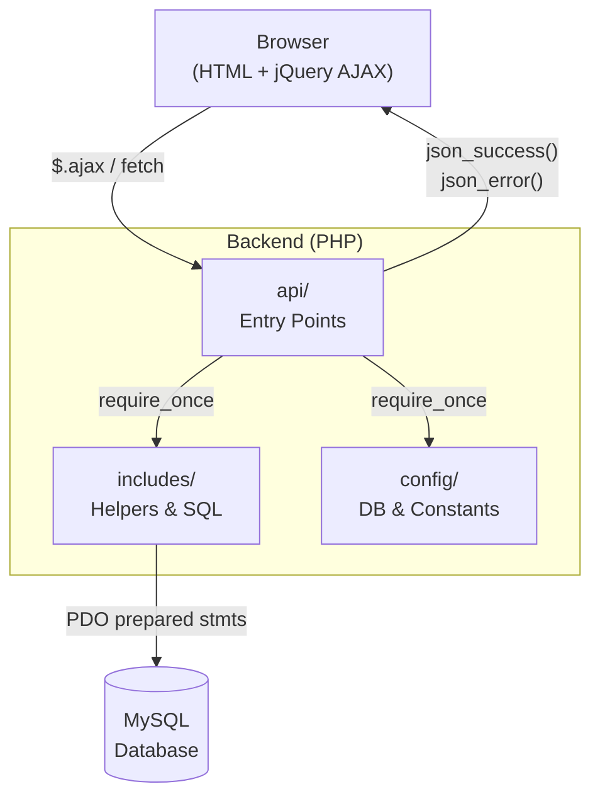
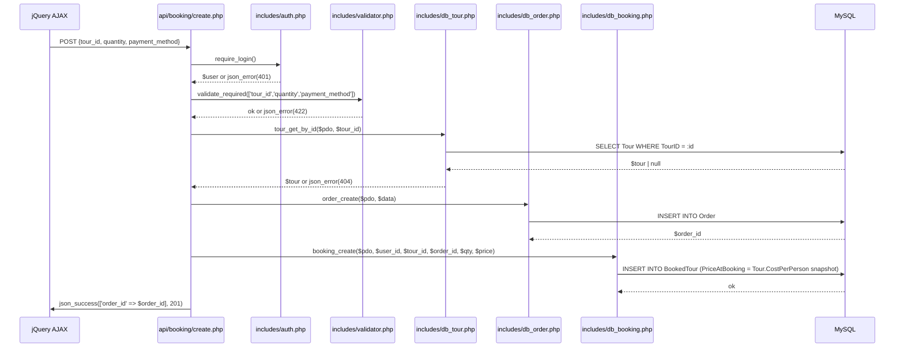

# ARCHITECTURE.md — Backend (Procedural PHP, Layer-based)

## Tech Stack
- **Language:** PHP 8.1+ | **Style:** Procedural | **DB:** MySQL 8.0+ via PDO

---

## 1. System Overview



---

## 2. Folder Structure

```
backend/
├── config/
│   ├── db.php                  # PDO singleton → exposes $pdo
│   └── constants.php           # TOUR_STATUS_*, ORDER_STATUS_*, USER_ROLE_*
│
├── api/                        # One file = one AJAX endpoint (verb_noun.php)
│   ├── tour/
│   │   ├── get_list.php        # GET  — list available tours (+ category filter)
│   │   ├── get_detail.php      # GET  — single tour + images
│   │   └── search.php          # GET  — keyword/date/location search
│   ├── category/
│   │   └── get_list.php        # GET  — category tree (ParentID hierarchy)
│   ├── booking/
│   │   ├── create.php          # POST — create Order + BookedTour rows
│   │   └── get_by_user.php     # GET  — order history for current user
│   ├── user/
│   │   ├── login.php           # POST — verify password, start session
│   │   ├── register.php        # POST — create User (Customer role)
│   │   └── logout.php          # POST — destroy session
│   └── admin/                  # All endpoints require Role = Admin
│       ├── tour_create.php
│       ├── tour_update.php
│       ├── tour_delete.php
│       ├── user_list.php
│       └── order_list.php
│
├── includes/                   # Never called directly by browser
│   ├── db_tour.php             # tour_get_list(), tour_get_by_id(), tour_search()
│   ├── db_category.php         # category_get_list(), category_get_tree()
│   ├── db_booking.php          # booking_create(), booking_get_by_user()
│   ├── db_order.php            # order_create(), order_update_status()
│   ├── db_user.php             # user_find_by_email(), user_create()
│   ├── response.php            # json_success() / json_error()
│   ├── validator.php           # validate_required(), validate_positive_int()
│   └── auth.php                # is_logged_in(), require_login(), require_role()
│
└── uploads/                    # Stored outside web root; MIME + size validated
```

---

## 3. Layer Anatomy

| Layer | Path | Owns | Must NOT |
|---|---|---|---|
| **Entry** | `api/**/*.php` | Parse input, validate, respond | Write SQL, `echo` JSON directly |
| **Data** | `includes/db_*.php` | All SQL per feature domain | Read `$_POST/$_GET`, call `http_response_code()` |
| **Shared** | `includes/response.php`<br>`validator.php` `auth.php` | Cross-cutting utilities | Contain business or DB logic |
| **Config** | `config/` | PDO connection, constants | Contain any business logic |

---

## 4. Request Flow



**Key rule from DATABASE.md:** `PriceAtBooking` must be snapshotted from `Tour.CostPerPerson`
at insert time — never recalculated from a live JOIN later.

---

## 5. Cross-feature Communication

**Rule:** `api/` files may `require_once` any `includes/db_*.php`. Helper files must never
require each other.

```php
// ✅ api/booking/create.php — cross-feature via require
require_once '../../includes/db_tour.php';    // Tour Catalog feature
require_once '../../includes/db_order.php';   // Booking feature
require_once '../../includes/db_booking.php'; // Booking feature

$tour = tour_get_by_id($pdo, $tour_id);
if (!$tour || $tour['TourStatus'] !== TOUR_STATUS_AVAILABLE) {
    json_error('Tour not available', 409);
}
```

```php
// ❌ includes/db_booking.php must NOT require includes/db_tour.php
require_once 'db_tour.php'; // circular-risk, breaks layer boundary
```

---

## 6. Shared vs Config

| `includes/` — Shared | `config/` — Infrastructure |
|---|---|
| `response.php` — JSON output helpers | `db.php` — PDO connection, exposes `$pdo` |
| `validator.php` — input type/presence checks | `constants.php` — all ENUM mirrors |
| `auth.php` — session state, role gate | *(nothing else goes here)* |
| `db_{feature}.php` — SQL grouped by domain | |

**`config/constants.php` mirrors every ENUM from DATABASE.md:**
```php
const TOUR_STATUS_AVAILABLE  = 'Available';
const TOUR_STATUS_FULL       = 'Full';
const TOUR_STATUS_CANCELLED  = 'Cancelled';
const ORDER_STATUS_PENDING   = 'Pending';
const ORDER_STATUS_CONFIRMED = 'Confirmed';
const PAYMENT_STATUS_UNPAID  = 'Unpaid';
const PAYMENT_STATUS_PAID    = 'Paid';
const USER_ROLE_ADMIN        = 'Admin';
const USER_ROLE_CUSTOMER     = 'Customer';
```

---

## 7. Configuration & Secrets

**`config/db.php`:**
```php
<?php declare(strict_types=1);
$pdo = new PDO(
    sprintf('mysql:host=%s;dbname=%s;charset=utf8mb4',
        $_ENV['DB_HOST'] ?? 'localhost',
        $_ENV['DB_NAME'] ?? 'tour_selling'),
    $_ENV['DB_USER'] ?? 'root',
    $_ENV['DB_PASS'] ?? '',
    [PDO::ATTR_ERRMODE => PDO::ERRMODE_EXCEPTION,
     PDO::ATTR_DEFAULT_FETCH_MODE => PDO::FETCH_ASSOC]
);
```

**`.env`** (gitignored — never committed):
```
DB_HOST=localhost
DB_NAME=tour_selling
DB_USER=root
DB_PASS=secret
```

**`.gitignore` must include:**
```
.env
uploads/
```

---

## 8. Admin Gate

Every file under `api/admin/` must start with:
```php
require_once '../../includes/auth.php';
require_login();                        // → json_error(401) if no session
require_role(USER_ROLE_ADMIN);          // → json_error(403) if not Admin
```

Customer endpoints only call `require_login()` — no role check needed.
