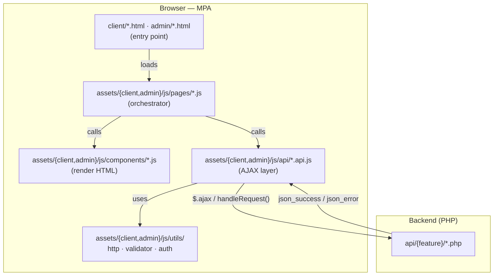
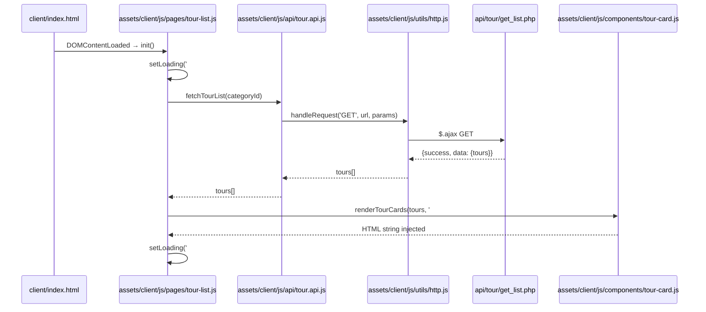

# ARCHITECTURE.md — Frontend (Vanilla JS + jQuery, MPA)

## Tech Stack
- **Markup:** HTML5 | **Style:** CSS3 | **Logic:** Vanilla JS (ES6+) + jQuery
- **Pattern:** Multi-Page Application — no client-side router, no bundler
- **Why MPA:** Matches PHP backend naturally; each URL = one `.html`/`.php` file;
  no build step required for solo rapid deployment
- **Audience split:** `client/` (public-facing) and `admin/` (back-office) live in
  separate folders, each with its own asset bundle under `assets/{client,admin}/`.

---

## 1. System Overview



---

## 2. Folder Structure

```
frontend/
├── client/                         # Public-facing HTML entry points
│   ├── index.html                  # Tour listing (public)
│   ├── tour-detail.html            # Tour detail + gallery (public)
│   └── cart.html                   # Shopping cart / checkout (protected)
│
├── admin/                          # Admin-only HTML entry points
│   ├── login.html
│   ├── dashboard.html
│   ├── order-management.html
│   └── order-changing.html
│
├── assets/
│   ├── client/                     # ── Assets used by client/*.html ──
│   │   ├── css/
│   │   │   └── style-1.css         # ⚠ Monolithic — will be split per planned structure
│   │   ├── js/
│   │   │   ├── api/                # AJAX layer — no DOM, no UI
│   │   │   │   └── tour.api.js     # fetchTourList(), fetchTourDetail()
│   │   │   ├── components/         # Render layer — HTML strings + event binding
│   │   │   │   └── tour-card.js    # renderTourCard(tour) → string
│   │   │   ├── pages/              # Orchestration — one file per page
│   │   │   │   ├── tour-list.js
│   │   │   │   ├── tour-detail.js
│   │   │   │   └── cart.js
│   │   │   ├── utils/              # Pure helpers — no feature knowledge
│   │   │   │   ├── http.js         # handleRequest() — base $.ajax wrapper
│   │   │   │   ├── format.js       # formatPrice(), formatDate()
│   │   │   │   └── cart.js         # cart storage helpers
│   │   │   └── script.js           # Shared client-side bootstrap
│   │   └── images/                 # Client images (logo, products, news, …)
│   │
│   └── admin/                      # ── Assets used by admin/*.html ──
│       ├── css/
│       │   └── style.css           # Admin layout / dashboard styles
│       ├── js/                     # (script.js, tinymce-config.js, account.js — to be added)
│       └── images/                 # Admin images (header-bell, avatars, dashboard icons)
│
└── docs/
    ├── FE-ARCHITECTURE.md
    └── FE-PROJECT-RULES.md
```

> Path rule: an HTML file at `frontend/<audience>/page.html` references its assets
> via `../assets/<audience>/...` — never the bare `assets/...` form.

---

## 3. Layer Anatomy

> Replace `<audience>` with `client` or `admin` depending on which bundle the layer belongs to.

| Layer | Path | Owns | Must NOT |
|---|---|---|---|
| **Page** | `assets/<audience>/js/pages/*.js` | Init, orchestrate API→render flow, bind page events | Write SQL, call `$.ajax` directly |
| **API** | `assets/<audience>/js/api/*.api.js` | `handleRequest()` calls, map response shape | Touch DOM, show toasts |
| **Component** | `assets/<audience>/js/components/*.js` | Build HTML strings, bind component events | Call API, know page state |
| **Utils** | `assets/<audience>/js/utils/*.js` | Pure helpers, no side effects | Know about features or pages |
| **CSS** | `assets/<audience>/css/` | Visual only, BEM-lite classes | Drive JS behavior |

---

## 4. Data Flow



**State rule:** No global JS state object. Page-level state lives as `const` variables
inside the page's `init()` scope. Shared state (session/user) is read from
`sessionStorage` via `utils/auth.js` only.

---

## 5. Cross-page Communication

| Method | Use case | Example |
|---|---|---|
| **URL query params** | Pass data between pages | `tour-detail.html?tour_id=12` |
| **`sessionStorage`** | Auth state, current user | `auth.js` reads/writes `currentUser` |
| **`localStorage`** | Persist UI prefs / cart contents | `utils/cart.js` storage |
| **Custom jQuery events** | Decouple components on same page | `$(document).trigger('cart:updated')` |

```js
// ✅ Passing tour ID from listing → detail page (client/)
// assets/client/js/pages/tour-list.js
window.location.href = `tour-detail.html?tour_id=${tourId}`;

// assets/client/js/pages/tour-detail.js
const tourId = new URLSearchParams(location.search).get('tour_id');
```

```js
// ✅ Auth state — assets/<audience>/js/utils/auth.js
function getSession() {
    return JSON.parse(sessionStorage.getItem('currentUser') ?? 'null');
}
function redirectIfNotLoggedIn() {
    if (!getSession()) window.location.href = '/frontend/admin/login.html';
}
```

---

## 6. Page Access Control (MPA equivalent of routing)

No client-side router — access control runs at the top of each page JS file.

```
Public pages         → no auth check
Protected pages      → redirectIfNotLoggedIn()
Admin pages          → redirectIfNotLoggedIn() + redirectIfNotAdmin()
```

```js
// ✅ assets/client/js/pages/cart.js — protected page
redirectIfNotLoggedIn();   // runs before any API call or render
```

```js
// ✅ assets/admin/js/pages/dashboard.js — admin-only page
redirectIfNotLoggedIn();
redirectIfNotAdmin();      // checks getSession().role === 'Admin'
```

**Page access map:**

| Page | Access | Guard |
|---|---|---|
| `client/index.html` | Public | — |
| `client/tour-detail.html` | Public | — |
| `admin/login.html` | Public | Redirect to dashboard if already logged in |
| `client/cart.html` | Customer + Admin | `redirectIfNotLoggedIn()` |
| `admin/*.html` (except login) | Admin only | `redirectIfNotLoggedIn()` + `redirectIfNotAdmin()` |

---

## 7. Shared vs Utils

| `assets/<audience>/js/components/` | `assets/<audience>/js/utils/` |
|---|---|
| `toast.js` — user-facing notifications | `http.js` — raw AJAX wrapper |
| `modal.js` — generic modal open/close | `validator.js` — pure input checks |
| `pagination.js` — render + bind page btns | `format.js` — price, date formatters |
| `tour-card.js` — feature-specific render | `auth.js` — session read/write |

> **Rule:** `utils/` must have zero jQuery DOM calls. `components/` may use jQuery
> only for event binding after HTML is injected.
>
> **Rule:** anything genuinely shared between `client/` and `admin/` must be
> duplicated into both `assets/client/js/utils/` and `assets/admin/js/utils/` —
> no cross-bundle imports, since each HTML page only loads its own audience bundle.

---

## 8. FE ↔ BE Contract

Mirrors `BE ARCHITECTURE.md` Section 4 — every `assets/<audience>/js/api/*.api.js`
function maps 1-to-1 with a `backend/api/{feature}/*.php` endpoint.

| FE function | BE endpoint | Method |
|---|---|---|
| `fetchTourList(categoryId)` | `api/tour/get_list.php` | GET |
| `fetchTourDetail(tourId)` | `api/tour/get_detail.php` | GET |
| `fetchCategoryList()` | `api/category/get_list.php` | GET |
| `submitBooking(data)` | `api/booking/create.php` | POST |
| `fetchUserOrders()` | `api/booking/get_by_user.php` | GET |
| `loginUser(data)` | `api/user/login.php` | POST |
| `registerUser(data)` | `api/user/register.php` | POST |

All responses follow: `{ success: bool, data?: any, message?: string }`
