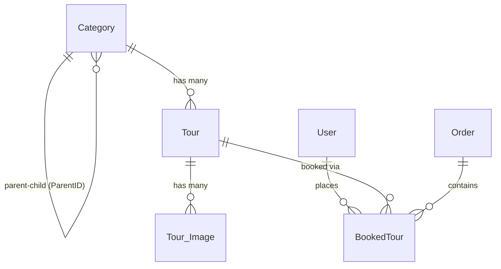

# DATABASE.md — Tour Selling

## 1. Overview

- **Database:** MySQL 8.0+
- **ORM / Query Builder:** None — raw SQL via PHP PDO (prepared statements required)
- **Naming Conventions:**
  - Tables: `PascalCase` (e.g., `BookedTour`, `Tour_Image`)
  - Columns: `PascalCase` (e.g., `CategoryID`, `TourStatus`)
  - Primary Keys: `{TableName}ID` (e.g., `TourID`, `UserID`)
  - Foreign Keys: match referenced PK name exactly (e.g., `CategoryID` → `Category.CategoryID`)
  - Indexes: `idx_{table}_{column}` (e.g., `idx_tour_categoryid`)

---

## 2. Entities by Feature

### Feature: Tour Catalog
> Manage tour listings, categories, and gallery images.

**`Category`**
| Column | Type | Constraints |
|---|---|---|
| CategoryID | INT | PK, AUTO_INCREMENT |
| Name | VARCHAR(255) | NOT NULL |
| CategoryThumbnail | VARCHAR(500) | NULL |
| CategoryStatus | ENUM('Active','Inactive') | NOT NULL, DEFAULT 'Active' |
| Description | TEXT | NULL |
| Location | VARCHAR(255) | NULL |
| ParentID | INT | FK → Category.CategoryID, NULL (top-level) |

- Index: `idx_category_parentid` on `ParentID`

**`Tour`**
| Column | Type | Constraints |
|---|---|---|
| TourID | INT | PK, AUTO_INCREMENT |
| Title | VARCHAR(255) | NOT NULL |
| Vehicle | VARCHAR(100) | NULL |
| Timeline | TEXT | NULL |
| TourSchedule | TEXT | NULL |
| DeparturePlace | VARCHAR(255) | NULL |
| DepartureDate | DATE | NOT NULL |
| Duration | VARCHAR(100) | NULL |
| CostPerPerson | DECIMAL(10,2) | NOT NULL |
| TourThumbnail | VARCHAR(500) | NULL |
| TourStatus | ENUM('Available','Full','Cancelled') | NOT NULL, DEFAULT 'Available' |
| MaxParticipants | INT | NOT NULL |
| CategoryID | INT | FK → Category.CategoryID, NOT NULL |

- Index: `idx_tour_categoryid` on `CategoryID`
- Index: `idx_tour_status` on `TourStatus`
- Index: `idx_tour_departuredate` on `DepartureDate`

**`Tour_Image`**
| Column | Type | Constraints |
|---|---|---|
| ImageID | INT | PK, AUTO_INCREMENT |
| Source | VARCHAR(500) | NOT NULL |
| TourID | INT | FK → Tour.TourID, NOT NULL |

- Index: `idx_tourimage_tourid` on `TourID`

---

### Feature: Booking & Orders
> Handle customer bookings, payment, and order tracking.

**`Order`**
| Column | Type | Constraints |
|---|---|---|
| OrderID | INT | PK, AUTO_INCREMENT |
| PaymentMethod | VARCHAR(100) | NOT NULL |
| OrderDate | DATETIME | NOT NULL, DEFAULT CURRENT_TIMESTAMP |
| OrderStatus | ENUM('Pending','Confirmed','Cancelled','Completed') | NOT NULL, DEFAULT 'Pending' |
| Note | TEXT | NULL |
| TotalPrice | DECIMAL(10,2) | NOT NULL |
| PaymentStatus | INT | NOT NULL, DEFAULT 0 (`0` = Unpaid, `1` = Paid, `2` = Refunded) |

- Index: `idx_order_status` on `OrderStatus`

**`BookedTour`** *(junction / line-item table)*
| Column | Type | Constraints |
|---|---|---|
| UserID | INT | FK → User.UserID, NOT NULL |
| TourID | INT | FK → Tour.TourID, NOT NULL |
| OrderID | INT | FK → Order.OrderID, NOT NULL |
| Quantity | INT | NOT NULL, DEFAULT 1 |
| PriceAtBooking | DECIMAL(10,2) | NOT NULL |

- **Composite PK:** `(UserID, TourID, OrderID)`
- Index: `idx_bookedtour_userid` on `UserID`
- Index: `idx_bookedtour_tourid` on `TourID`
- Index: `idx_bookedtour_orderid` on `OrderID`

---

### Feature: User Management
> Authentication, roles, and account control.

**`User`**
| Column | Type | Constraints |
|---|---|---|
| UserID | INT | PK, AUTO_INCREMENT |
| FullName | VARCHAR(255) | NOT NULL |
| DateOfBirth | DATE | NULL |
| Address | VARCHAR(500) | NULL |
| Email | VARCHAR(255) | NOT NULL, UNIQUE |
| Password | VARCHAR(255) | NOT NULL (bcrypt hashed) |
| PhoneNumber | VARCHAR(20) | NULL |
| Status | TINYINT(1) | NOT NULL, DEFAULT 1 (`1` = Active, `0` = Locked) |
| role | VARCHAR(50) | NOT NULL, DEFAULT 'user' |

- Index: `idx_user_email` on `Email`
- Index: `idx_user_role` on `role`

> ⚠ Naming exception: cột `role` lưu lowercase (không theo quy ước PascalCase chung của các cột khác). Khi viết SQL phải dùng đúng tên `role`. Giá trị lowercase: `'admin'` (full quyền) và `'user'` (khách hàng). Validate giá trị ở tầng PHP trước khi `INSERT`/`UPDATE`.

---

## 3. Relationships

**Cross-feature relationships:**
| From Feature | To Feature | Via Column | Description |
|---|---|---|---|
| Booking | Tour Catalog | `BookedTour.TourID` | Links a booking line-item to a tour |
| Booking | User Management | `BookedTour.UserID` | Links a booking to the customer |

---

## 4. Conventions

- **Primary Key:** `INT AUTO_INCREMENT` on all tables; composite PK on `BookedTour`
- **Soft Delete:** Not implemented — use `Status` / `TourStatus` / `OrderStatus` ENUM columns to deactivate records instead of deleting
- **Timestamps:** Only `Order.OrderDate` uses `DEFAULT CURRENT_TIMESTAMP`; other tables do not have auto-timestamps (add manually if needed)
- **Price Snapshot:** `BookedTour.PriceAtBooking` stores the price at time of purchase — never join to `Tour.CostPerPerson` for historical order data
- **ENUM Handling:** Defined at the column level in MySQL; validated in PHP before INSERT/UPDATE
- **Password Storage:** Always store passwords as bcrypt hashes via PHP `password_hash()`; never store plaintext

---

## 5. Table Creation Order

Must be followed to satisfy foreign key constraints:

| Order | Table | Reason |
|---|---|---|
| 1 | `Category` | Self-referencing `ParentID` (nullable) |
| 2 | `User` | No foreign keys |
| 3 | `Order` | No foreign keys |
| 4 | `Tour` | Depends on `Category` |
| 5 | `Tour_Image` | Depends on `Tour` |
| 6 | `BookedTour` | Depends on `User`, `Tour`, `Order` |

---

## 6. Migration Rules

- **Naming Format:** `V{version}__{description}.sql` — e.g., `V001__create_category_table.sql`
- **Versioning:** Sequential integers (`V001`, `V002`, …); never reuse a version number
- **Each file must be idempotent:** Use `CREATE TABLE IF NOT EXISTS`, `ALTER TABLE ... ADD COLUMN IF NOT EXISTS`
- **Rollback:** Provide a paired `V{version}__rollback_{description}.sql` for every structural change (DROP TABLE / DROP COLUMN)
- **No mixed concerns:** One migration file = one logical change (do not combine table creation and data seeding)
- **Seed data:** Stored in separate `seed/` files, never in migration files
